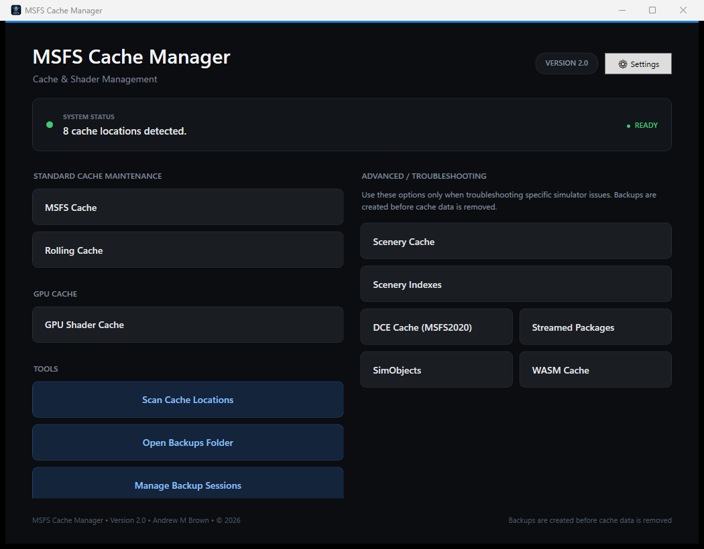

# MSFS Cache Manager

MSFS Cache Manager is a Windows desktop utility for inspecting, backing up, clearing, and restoring selected Microsoft Flight Simulator and GPU cache data.



## Highlights

- Supports Microsoft Flight Simulator 2020 and 2024 cache locations.
- Detects Steam/standalone, Microsoft Store, and custom package paths.
- Scans cache size, file count, last-modified time, platform, simulator, and risk level.
- Moves cache data into timestamped backup sessions instead of permanently deleting it.
- Creates a JSON restore manifest and detailed report for every new backup session.
- Restores sessions without overwriting files already present in active locations.
- Runs scans, backups, and restores asynchronously with progress and cancellation.
- Rejects backup folders that overlap managed cache locations.

## Supported cache groups

| Cache group | Simulator | Risk | Typical use |
| --- | --- | --- | --- |
| General MSFS cache | 2020 and 2024 | Standard | Routine cache maintenance |
| Rolling cache | 2020 and 2024 | Standard | Reset rolling-cache data |
| NVIDIA/AMD shader cache | All simulators | Standard | Graphics or shader troubleshooting |
| Scenery cache | Primarily 2020 | Advanced | Scenery troubleshooting |
| Scenery indexes | 2020 and 2024 | Advanced | Rebuild scenery indexes |
| DCE cache | 2020 | Advanced | Targeted MSFS 2020 troubleshooting |
| Streamed Packages | 2024 | Advanced | Re-download streamed content |
| SimObjects | 2020 and 2024 | Advanced | Aircraft or AI-object troubleshooting |
| WASM cache | 2020 and 2024 | Advanced | Aircraft/add-on module troubleshooting |

Advanced operations can cause longer simulator loading times while content is rebuilt or downloaded again.

## Requirements

For a packaged release:

- Windows 10 or Windows 11, x64
- Microsoft Flight Simulator must be completely closed during backup or restore operations

Release packages are self-contained and do not require a separate .NET installation. Current builds are unsigned, so Windows may display a SmartScreen warning.

To build from source, install the .NET 8 SDK.

## Basic use

1. Close Microsoft Flight Simulator completely.
2. Select **Scan Cache Locations** to review detected data and estimated size.
3. Use a Standard or Advanced cleanup button as appropriate.
4. Review the confirmation warning and continue only if the listed cache is intended.
5. Open **Manage Backup Sessions** to inspect reports or restore a session.
6. Keep backups until the simulator and affected add-ons have been tested.

The default backup folder is:

```text
Documents\MSFS Cache Manager\Backups
```

The location can be changed in Settings. The application blocks backup locations that overlap known cache paths.

## Backup and restore behavior

Each cleanup creates a timestamped session containing:

- Moved cache files and folders
- `backup_manifest.json`, mapping backup paths to original locations
- `backup_report.txt`, containing operation details and errors
- Restore reports created by later restore attempts

Restore never overwrites an existing file. Conflicts remain in the backup session and can be retried after the active file is moved or removed.

Older v1.1 backup sessions created without a JSON manifest remain available for manual restoration using their text report.

## Build and test

```powershell
dotnet restore Tests\MSFSCacheManager.Tests.csproj
dotnet build MSFSCacheManager.csproj --configuration Release
dotnet test Tests\MSFSCacheManager.Tests.csproj --configuration Release
```

The automated suite covers path separation, partial and locked-file moves, collision handling, simulated cross-volume fallback, manifests, restore conflicts, cancellation, cache scanning, and `UserCfg.opt` parsing.

## Create a local release package

```powershell
dotnet publish MSFSCacheManager.csproj `
  --configuration Release `
  --runtime win-x64 `
  --self-contained true `
  -p:PublishSingleFile=true `
  -p:IncludeNativeLibrariesForSelfExtract=true `
  -p:DebugType=None `
  --output artifacts\win-x64
```

Pushing a tag such as `v1.2.0` runs the release workflow, verifies the tests, produces a self-contained ZIP, and creates a GitHub release with generated notes.

## Safety and support

- Do not run cleanup or restore while MSFS is open.
- Review Advanced-operation warnings carefully.
- Keep backups until normal simulator operation is confirmed.
- Report security concerns using GitHub's private security-advisory feature where available.

MSFS Cache Manager is an independent utility and is not affiliated with or endorsed by Microsoft Corporation, Xbox Game Studios, or Asobo Studio.

## License

MSFS Cache Manager is licensed under the [MIT License](LICENSE).

Copyright (c) 2026 Andrew M Brown.
